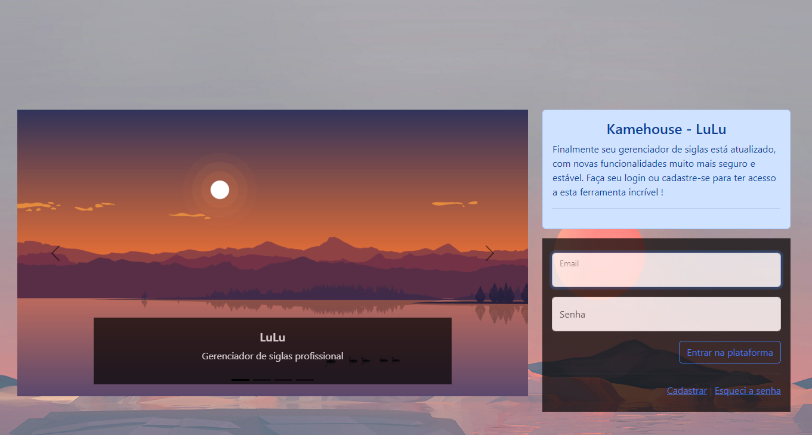
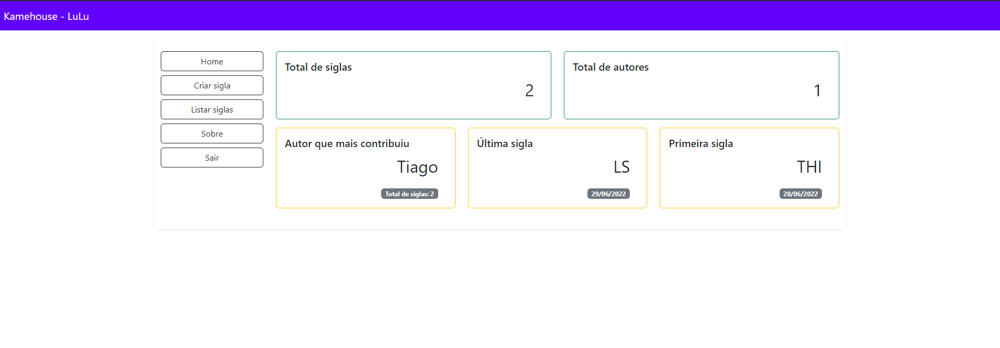
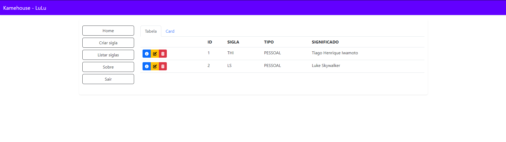
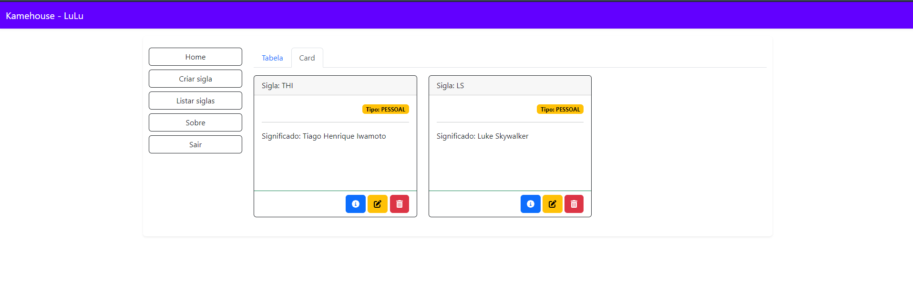
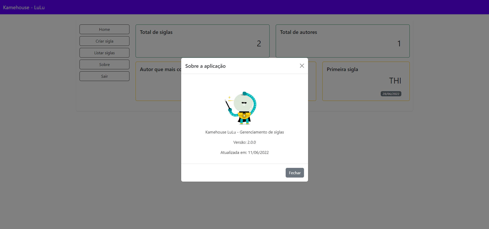

### LuLu Application v2.0
Aplicação para catalogar siglas

### Arquitetura
Código limpo, com as versões mais atualizadas do spring.

### Telas / Preview

### Build
 >mvn clean package

### Rodando a aplicação
na raiz do projeto rode o docker-compose up para subir a versão do Postgres;
Se necessário altere a senha no arquivo application.properties
Rode a aplicação em sua IDE de preferencia.

### Tecnologias
 - Java 18
 - SpringMVC
 - SpringData
 - Spring Security
 - Spring Cache
 - Thymeleaf
 - Lombok
 - Junit 5
 - Postgres
 - Bootstrap 5
 - FontAwesome 6
 - Google Fonts
